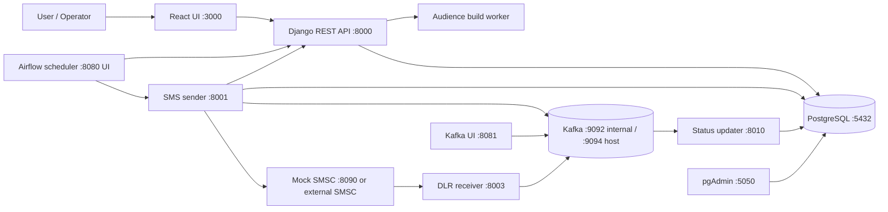

# SMS Campaign Platform: Architecture and Operations

## 0. Introduction

This repository contains a web application for defining, scheduling, and monitoring SMS campaigns. Users create a campaign, choose an audience and message, set a schedule, and then the platform builds recipient-specific messages and submits them to an SMSC (SMS service centre). The platform tracks provider submission results and asynchronous delivery reports. It also supports test SMS messages and scheduled campaign email reports.

The local Docker Compose stack is the main integrated deployment described here. It runs the React UI, Django REST API, PostgreSQL, Kafka, Airflow, an SMS sender, an audience-building worker, a status consumer, a delivery-report receiver, and a mock SMSC. Some standalone packages in the repository are useful for manual or older deployments but are not services in the Compose stack; they are identified below.

## 1. High-Level Architecture



Compose services communicate by service name on the `sms-network` network. For example, containers use `http://django:8000/api/v1` and `kafka:9092`; browser users use host-mapped ports such as `http://localhost:8000` and `http://localhost:3000`.

Kafka UI is available at `http://localhost:8081`. It connects to the broker using `kafka:9092` on the Compose network and can be used to inspect topics, messages, and consumer groups.

The two Kafka topics created at startup are:

| Topic | Producer | Consumer | Purpose |
| --- | --- | --- | --- |
| `sent-response` | SMS sender | Status updater | SMSC submission outcomes |
| `delivery-report` | DLR receiver | Status updater | Asynchronous SMSC delivery receipts |

Compose creates each topic with 20 partitions and replication factor 1 for local development. Kafka is not configured as a highly available production cluster.

The sender publishes `SENT_RESPONSE` events to `sent-response` for accepted messages and terminal failures; retryable send failures stay in the sender queue until retried or made terminal. The DLR receiver publishes `DELIVERY_REPORT` events to `delivery-report`. The status updater runs consumer groups `status-updater-send` and `status-updater-delivery`, writes each batch to PostgreSQL before committing Kafka offsets, and retries a failed batch. Its `GET /health` response reports Kafka/database connectivity, each consumer's running state, consumed event/batch totals, last batch time, and last error. The four terminal tables are idempotent event history: successful sends use `SuccessSent`, terminal send failures use `FailedSent`, successful receipts use `SuccessDelivery`, and non-success receipts use `FailedDelivery`.

## 2. Applications and Responsibilities

| Application / service | What it does and how | Compose access |
| --- | --- | --- |
| `sms-ui` | React/Vite web interface. Calls the Django API for campaigns, audiences, schedules, messages, reports, and configuration. | `http://localhost:3000` |
| `django` (`sms_campign`) | Django REST Framework API and central business/data layer. Validates requests, manages campaign lifecycle and configuration, exposes OpenAPI docs, and reads/writes the campaign database. | `http://localhost:8000`; Swagger at `/api/v1/docs/`; schema at `/api/v1/schema/`; Django admin at `/admin/` |
| `audience-worker` | Runs `manage.py run_audience_build_jobs`. Builds or rebuilds large audiences asynchronously using stored audience configuration and the configured source database/file/manual data. | No host port; progress is queried through Django API endpoints. |
| `sms-sender` (`sms_smsc_sender`) | FastAPI service that selects pending `MessageObject` rows, applies global/SMSC throughput and batch limits, submits SMS batches to the configured SMSC, retries failures, and publishes submission outcomes to Kafka. | `http://localhost:8001`; health at `/health`; controls at `/sender/start`, `/sender/stop`, `/sender/status`, `/run-once` |
| `status-updater` (`sms_status_updater`) | Consumes `sent-response` and `delivery-report`, validates and batches events, and persists successful/failed send and delivery outcomes in Django's database. | `http://localhost:8010/health`; no user workflow endpoint. |
| `dlr-receiver` (`dlr_receiver`) | Accepts SMSC delivery callbacks, validates and queues them, then publishes them to Kafka with retry handling. It does not write campaign records directly. | `http://localhost:8003/api/v1/delivery-reports/callback/`; health at `/health` |
| `smsc-mock` (`sms_smsc_mock`) | Local test SMSC. Accepts the configured HTTP SMS contract, returns submission IDs, stores mock state in its own SQLite file, and asynchronously posts randomized delivery outcomes to the DLR receiver. | `http://localhost:8090`; submit at `/onion/swift/duos`; health at `/health`; inspect a message at `/api/messages/{message_id}` |
| `airflow-scheduler` / `airflow-webserver` | Scheduler runs the campaign dispatch DAG every minute and the report dispatch DAG every minute. DAGs call Django to find due schedules/build work and call the sender to start/stop campaigns. The webserver displays DAG and task status/logs. | UI at `http://localhost:8080`; local default login is `admin` / `change-this-local-password` unless overridden. |
| `airflow-init` | One-shot setup job: migrates Airflow metadata and creates the configured Airflow admin if absent. | No host port. |
| `db` | PostgreSQL 16 stores Django campaign data and, in this local Compose setup, Airflow metadata in the same database. | Internal port 5432; no host port is published. |
| `kafka` / `kafka-init` | Kafka event broker and one-shot topic creation job. | Host listener at `localhost:9094`; containers use `kafka:9092`. |
| `kafka-ui` | Browser interface for inspecting the Kafka broker, topics, messages, and consumer groups. | `http://localhost:8081`; connects to `kafka:9092` within Compose. |
| `pgadmin` | Browser-based database administration client. | `http://localhost:5050`; local defaults are `admin@example.com` / `pgadmin_dev_password`. Add a server connection to host `db`, port `5432`, using the Compose PostgreSQL environment values. |

### Standalone packages not started by Compose

| Package | Purpose and access when run manually | Note |
| --- | --- | --- |
| `sms_campaign_scheduler` | Standalone FastAPI scheduler; documented at port `8093`, with `/health`, `/run-once`, `/worker/start`, and `/worker/stop`. | Compose uses Airflow DAGs for dispatch instead. |
| `sms_delivery_receiver` | Older/direct FastAPI callback receiver; its README documents port `8092` and `/api/v1/delivery-reports/callback/`. | Compose uses `dlr_receiver` on port `8003`, which publishes to Kafka. Do not point the Compose mock at the standalone receiver unless intentionally testing that alternate path. |

The standalone sender README documents a manual port of `8091`; the Compose sender is mapped to host port `8001`. Use the Compose mapping when the Compose stack is running.

## 3. Database Tables

The application models are in `sms_campign/sms_campaign_manager/models.py`. Unless a model explicitly overrides its table name, Django names its tables `sms_campaign_manager_<modelname>` in lowercase. The following table names therefore refer to the default Django naming convention. Django's built-in auth, session, and content-type tables also exist. Airflow creates its own metadata tables in the same local PostgreSQL database.

| Table | Purpose |
| --- | --- |
| `sms_campaign_manager_channel` | SMS and other supported delivery-channel reference values. Campaign channel IDs are stored as JSON on the campaign, not in a join table. |
| `sms_campaign_manager_language` | Supported language codes and names. |
| `sms_campaign_manager_senderid` | Registered sender IDs, active/default selection, and audit ownership. |
| `sms_campaign_manager_smscconfig` | SMSC URL, endpoint, auth credentials, rate limits, retries, and health-test results. Credentials use the encrypted model field. |
| `sms_campaign_manager_testmessage` | Standalone SMSC test request/response history. |
| `sms_campaign_manager_globaltpsconfig` | Global throughput ceiling applied across campaigns. |
| `sms_campaign_manager_naddressesconfig` | Maximum recipient addresses per SMSC request. |
| `sms_campaign_manager_emailconfig` | SMTP connection details and last test result. |
| `sms_campaign_manager_campaignprogressreport` | Reusable scheduled HTML progress-report configuration. |
| `sms_campaign_manager_emailreport` | Campaign email report content, status, recipients, and send/error history. |
| `sms_campaign_manager_reportsubscription` | Report recipients, campaigns, format, included statistics, and delivery schedule. |
| `sms_campaign_manager_reportdeliverylog` | Per-attempt report delivery result and report snapshot. |
| `sms_campaign_manager_databaseconfig` | Connection metadata and encrypted credentials for external audience/source databases. |
| `sms_campaign_manager_campaign` | Campaign definition, selected sender/channels, lifecycle timestamps/status, readiness, and soft-delete state. |
| `sms_campaign_manager_messagecontent` | One campaign's multilingual message templates and fallback language. |
| `sms_campaign_manager_schedule` | One campaign's date range, time windows, recurrence, timezone, and run state. |
| `sms_campaign_manager_audience` | Built recipient rows, language/source, validation, round, and build identifiers. |
| `sms_campaign_manager_audienceconfig` | One campaign's manual/file/database source and optional language-mapper configuration, plus build statistics/state. |
| `sms_campaign_manager_audiencebuildjob` | Asynchronous audience build status, progress, results, and errors. |
| `sms_campaign_manager_customerprofileconfig` | Reusable external customer-profile table and language-column mapping. |
| `sms_campaign_manager_messageobject` | Pending sender queue containing personalized message, recipient, campaign, retry, batch, and lock information. |
| `sms_campaign_manager_messagebuildjob` | Message generation job status, phase, counts, and errors. |
| `sms_campaign_manager_sentrecord` | Normalized send-attempt history used by direct/legacy record paths. |
| `sms_campaign_manager_deliveryrecord` | Normalized delivery history used by direct/legacy record paths. |
| `sms_campaign_manager_successsent` | Permanent successful SMSC submission outcome consumed from send events. |
| `sms_campaign_manager_failedsent` | Permanent failed SMSC submission outcome, including attempts and provider error data. |
| `sms_campaign_manager_successdelivery` | Permanent successful delivery receipt. |
| `sms_campaign_manager_faileddelivery` | Permanent non-success delivery receipt and provider failure details. |

Additional automatic many-to-many tables are created for campaign links on `CampaignProgressReport` and `ReportSubscription`, and Django's built-in user/group permission relations. The mock SMSC's `smsc_mock.sqlite3` is a separate SQLite database; it is not part of the campaign PostgreSQL schema.

## 4. Logging

Application logs are written to process stdout/stderr, not to a central application log table. Docker captures the container streams, so use `docker compose logs` to inspect them. Airflow task logs are also stored in the `airflow_logs` Docker volume and are browsable from the Airflow UI.

| Component | What it logs | Configuration / access |
| --- | --- | --- |
| Django API and services | Campaign creation, audience build starts/results/failures, invalid build/schedule requests, message-build errors, and email notification failures. | Logger namespace `sms_campaign_manager`; format is timestamp, level, logger name, message. `DJANGO_CAMPAIGN_LOG_LEVEL` defaults to `INFO`. |
| SMS sender | Kafka publication errors and sender tick/worker exceptions. Provider request/response details may be retained in the database history as well. | Python logging level uses `LOG_LEVEL` (defaults to `INFO` in code). |
| DLR receiver | Kafka connection attempts, startup timeout, publish retries, and batches dropped after retry exhaustion. | `LOG_LEVEL`, default `INFO`; health counters are available at `/health`. |
| Status updater | Malformed or incomplete send/delivery events, unmatched delivery receipts, Kafka polling/batch failures, and database health failures. | Logger namespace `sms_status_updater`; service health at `/health`. |
| Mock SMSC | Failed delivery callback attempts, exhausted callbacks, and SQLite batch write failures. | `SMSC_MOCK_LOG_LEVEL`, default `INFO`. |
| Airflow DAGs | Dispatch decisions, audience/message build and campaign start/stop outcomes, report delivery outcomes, and exceptions. | Inspect DAG run task logs in the Airflow UI at `http://localhost:8080`. |

Useful local commands:

```powershell
docker compose logs -f django sms-sender status-updater dlr-receiver smsc-mock
docker compose logs -f airflow-scheduler
docker compose logs --tail 200 audience-worker
```

To verify Kafka without exposing event payloads, inspect the consumer health endpoint and group lag:

```powershell
Invoke-RestMethod http://localhost:8010/health | ConvertTo-Json -Depth 6
docker compose exec -T kafka /opt/kafka/bin/kafka-consumer-groups.sh --bootstrap-server kafka:9092 --describe --group status-updater-send
docker compose exec -T kafka /opt/kafka/bin/kafka-consumer-groups.sh --bootstrap-server kafka:9092 --describe --group status-updater-delivery
```

Healthy consumers report `running: true`, `kafka_connected: true`, and no `last_error`; after test traffic, `total_consumed`, `total_batches`, and `last_batch_at` should advance. Kafka group lag should return to zero after processing. The health response also includes counts from the four terminal history tables.

Some failure paths include event representations in warning/error logs. Treat logs as potentially sensitive: limit access and retention, and avoid putting credentials or unnecessary recipient data in test payloads. Docker's default log storage is not a durable centralized observability system; configure production log rotation/collection and retention separately.

## 5. Access and Local Startup

Start the integrated stack from the repository root:

```powershell
docker compose up --build -d
```

The Compose environment currently supplies local-development defaults for PostgreSQL, Airflow, and the mock SMSC. They are not production credentials. Before using the stack outside a private local environment, set strong values in `.env` for database passwords, Django/Airflow secrets, Airflow login, and SMSC mock credentials; protect encryption keys and SMTP/SMSC credentials.

| What you need | Local URL / access |
| --- | --- |
| Web UI | `http://localhost:3000` |
| Django API root | `http://localhost:8000/api/v1/` |
| API reference | `http://localhost:8000/api/v1/docs/` (Swagger), `http://localhost:8000/api/v1/redoc/`, `http://localhost:8000/api/v1/schema/` |
| Django admin | `http://localhost:8000/admin/`; create a Django superuser explicitly if needed (`python manage.py createsuperuser` in the Django container). |
| Airflow | `http://localhost:8080`; default local login `admin` / `change-this-local-password`, overridable through environment variables. |
| pgAdmin | `http://localhost:5050`; default local login `admin@example.com` / `pgadmin_dev_password`. PostgreSQL itself is not host-published. |
| SMS sender | `http://localhost:8001`; `/health`, `/sender/status`, and the sender controls. |
| Delivery callback receiver | `http://localhost:8003/api/v1/delivery-reports/callback/`; `/health` for readiness. |
| Mock SMSC | `http://localhost:8090`; `/health`, `POST /onion/swift/duos`, and message inspection endpoint. The send API uses HTTP Basic auth configured to match the active `SMSCConfig`. |
| Status updater | `http://localhost:8010/health` |
| Kafka host listener | `localhost:9094`; applications in Compose use `kafka:9092`. |

The Django API is configured for JWT authentication. Obtain a token from `POST /api/v1/auth/login/` and send it as `Authorization: Bearer <access-token>` for endpoints that require authentication. The exact permissions can vary by endpoint; do not assume the API-wide default permission setting makes every route public or protected in the same way.

## 6. End-to-End Campaign Workflow

### Prepare reference and transport configuration

1. Create or activate the supported channel(s), language(s), and sender ID. A campaign validates its sender ID against an active registered sender ID and its channel IDs against active channels.
2. Configure an active SMSC (`SMSCConfig`) with URL, endpoint, authentication, limits, timeout, and retry policy. For local end-to-end testing, point it to `http://mock-smsc.local:8090/onion/swift/duos` and use credentials matching `SMSC_MOCK_USERNAME` and `SMSC_MOCK_PASSWORD`.
3. Configure global TPS and maximum addresses per request. Configure email settings only if campaign notifications or report email delivery are needed.
4. For database-driven audiences, create a `DatabaseConfig`; optionally add a `CustomerProfileConfig` to map customer language data.

### Create and prepare the campaign

1. Create a campaign in the UI or with `POST /api/v1/campaigns/`, supplying its name, active sender ID, channels, and optional owner email recipients.
2. Define the audience as manual recipients, an uploaded file, or an external database source. Configure default/source language or a mapper where needed. Preview and validate the source before building.
3. Build the audience. Small or direct operations may finish in the API request; queued builds are processed by `audience-worker`. Track work with the audience-config progress/job endpoints. Built recipient rows are saved to the audience table with validity, language, round, and build metadata.
4. Add multilingual message content for the campaign and choose a default language. Message generation selects the recipient language where content exists and falls back to the configured default.
5. Add a campaign schedule with date range, timezone, recurrence, and one or more non-overlapping time windows. The campaign is ready when it has an active channel, a valid audience, message content, and a schedule.
6. Check campaign readiness/validation before activation. The relevant API operations include `GET /api/v1/campaigns/{id}/readiness/`, `POST /api/v1/campaigns/{id}/validate/`, and `POST /api/v1/campaigns/{id}/activate/`.

### Dispatch, send, and record outcomes

1. Airflow's `dispatch_campaigns` DAG polls due schedules every minute. It requests required audience rebuilds, waits for their progress, builds message rows if missing/rebuilt, activates due campaigns, and starts/stops sender campaigns to match schedule windows.
2. The sender reads pending `MessageObject` rows, applies throughput and request-size limits, submits batches to the configured SMSC, and retries retryable failures. Successful submission means the SMSC accepted the message; it does not mean the handset received it.
3. The sender publishes submission outcomes to `sent-response`. The status updater consumes the topic and persists accepted/rejected outcomes in the success/failure send history tables. The message queue is the pending work surface; history tables preserve terminal outcomes.
4. After submission, the SMSC sends a delivery receipt to the callback URL. The local mock does this after a configurable random delay. `dlr_receiver` accepts the callback and publishes a `delivery-report` event to Kafka; the status updater maps provider outcomes such as `DELIVRD`, `UNDELIV`, `EXPIRED`, and `REJECTD` into campaign delivery history.
5. Use campaign progress, message statistics, sent/delivery records, and report APIs in the UI or Swagger to monitor results. Configure report subscriptions if scheduled email reporting is required; Airflow's `dispatch_reports` DAG sends due subscriptions through Django.

## 7. Useful API Areas

All URLs below are relative to `/api/v1/` unless otherwise stated:

| Area | Common endpoints |
| --- | --- |
| Authentication | `auth/login/`, `auth/refresh/`, `auth/me/`, `auth/password/` |
| Campaigns | `campaigns/`, `campaigns/{id}/`, `campaigns/{id}/readiness/`, `validate/`, `activate/`, `start/`, `pause/`, `resume/`, `complete/`, `cancel/` |
| Audience | `audiences/`, `campaigns/{id}/audience/manual/`, `file/`, `database/`, `campaigns/{id}/audience-config/`, `audience-configs/{id}/build/`, `progress/` |
| Messages | `message-content/`, `campaigns/{id}/messages/build/`, `build-progress/`, `messages/`, `messages/stats/`, `messages/batches/` |
| Schedules | `schedules/`, `schedules/due-now/`, `campaigns/{id}/schedule/`, `campaigns/{id}/schedule/upcoming/` |
| Configuration | `channels/`, `languages/`, `sender-ids/`, `smsc-configs/`, `global-tps-config/`, `n-addresses-config/`, `databases/` |
| Reports | `report-subscriptions/`, `report-subscriptions/due-now/`, `report-subscriptions/{id}/send-now/`, `report-delivery-logs/{id}/` |
| Test SMS | `test-sms/` |

The Swagger UI at `/api/v1/docs/` is the complete, current endpoint reference and includes request/response schemas.

### Event-backed reports and refresh

Report subscription rows are generated by Django when `POST /api/v1/report-subscriptions/{id}/send-now/` is called. Their send/delivery totals and timestamps come from `SuccessSent`, `FailedSent`, `SuccessDelivery`, and `FailedDelivery`; pending queue and audience totals come from `MessageObject` and `Audience`. The manual campaign report endpoint (`POST /api/v1/campaigns/{id}/reports/email/`) uses the same event-history tables, with `SentRecord`/`DeliveryRecord` as a fallback for older campaigns that have no event-history rows. This avoids reading empty legacy tables for new Kafka-driven sends and avoids adding both paths together.

For scheduled email, create an active `ReportSubscription` with a non-manual frequency. Airflow's `dispatch_reports` DAG polls due subscriptions every minute, asks Django to render and send each report, and writes one delivery log per recipient. The subscription frequency controls when `next_run_at` becomes due; the one-minute DAG interval is the dispatcher check interval. Manual send uses the same Django report-building/sending path immediately. The UI campaign list refreshes campaign execution status every five minutes; the dashboard refreshes every 30 seconds while auto-refresh is enabled.

`CampaignProgressReport` (`/api/v1/email-reports/`) is a separate legacy report-definition resource; the current Airflow DAG does not dispatch it. Use `ReportSubscription` (`/api/v1/report-subscriptions/`) for scheduled email in the current UI and Compose deployment.

## 8. Operational Notes

- The Django container runs migrations on startup. The database uses the PostgreSQL service in Compose; local non-Compose settings default to SQLite.
- The Compose stack currently shares one PostgreSQL database between Django and Airflow for local convenience. A production deployment should isolate Airflow metadata and campaign data, use managed secrets, TLS, explicit authentication/authorization, and monitored/retained logs.
- `smsc-mock` has its own persistent SQLite volume. Resetting or replacing that volume is separate from the campaign PostgreSQL data.
- `sms_campaign_scheduler` and `sms_delivery_receiver` are alternative standalone paths; their READMEs describe their own ports and database settings. They are not substitutes for the Airflow + Kafka Compose event path without deliberate configuration changes.
- The top-level email configuration note may describe an earlier implementation. Use the current model definitions, Django URL routes, and Swagger schema as the source of truth for the running code.

## 9. Testing the Applications End to End

### What the existing tests prove

| Test level | What it checks | What it does not prove |
| --- | --- | --- |
| Python component tests | Sender request formatting and rate allocation; mock SMSC auth, storage, and callbacks; DLR callback validation/queueing; status-updater event handling; standalone scheduler behavior. | Real container networking or persistent services working together. |
| Django tests | Campaign/API rules, audience/message building, email configuration, report rendering, report delivery logs, and scheduled-report logic. Email send calls in report tests are mocked. | A real SMTP server accepted a message. |
| API acceptance test | `tests/test_flow_create_campaign.py` creates a campaign, content, audience, schedule, builds messages, checks readiness, and activates it using the running Django API. | It does not start the SMS sender, contact the mock SMSC, receive a DLR, or send an email. |
| Full local integration | Compose services, campaign dispatch, SMSC submission, Kafka status handling, DLR callback, real SMTP-to-Mailpit, and report delivery. | Production provider behavior or deliverability; use provider sandbox credentials for that. |

### 1. Run isolated automated tests

Run from the repository root with the project virtual environment active:

```powershell
$env:PYTHONPATH = "$(Get-Location)\sms_campign;$(Get-Location)"
$env:DJANGO_SETTINGS_MODULE = "sms_campign.settings"
python -m pytest sms_smsc_sender/test_app.py sms_smsc_mock/test_app.py dlr_receiver/test_app.py sms_status_updater/test_app.py sms_campaign_scheduler/test_app.py
python sms_campign/manage.py test sms_campaign_manager
```

The first command exercises the independent service tests; the Django command runs campaign, audience, and email/report tests against Django's test database. These tests do not require sending an SMS or email to a real provider. If the selected Python environment is not the project's venv, activate `venv\Scripts\Activate.ps1` first.

For the UI, from `sms_ui` run the project's scripts with Bun (the repository has a Bun lockfile):

```powershell
bun install --frozen-lockfile
bun run test
bun run lint
bun run build
```

### 2. Start and check the integrated stack

From the repository root:

```powershell
docker compose up --build -d
docker compose ps
```

Wait for `db`, `django`, `kafka`, `status-updater`, `dlr-receiver`, and `smsc-mock` to report healthy. `airflow-init` and `kafka-init` are one-shot jobs and should finish successfully rather than stay running. Inspect startup failures with `docker compose logs --tail 200 <service>`.

Check the public health/documentation endpoints:

```powershell
Invoke-RestMethod http://localhost:8000/api/v1/schema/
Invoke-RestMethod http://localhost:8001/health
Invoke-RestMethod http://localhost:8003/health
Invoke-RestMethod http://localhost:8010/health
Invoke-RestMethod http://localhost:8090/health
```

Open the UI at `http://localhost:3000` and Airflow at `http://localhost:8080`. Confirm the `dispatch_campaigns` and `dispatch_reports` DAGs are enabled.

### 3. Run the API campaign acceptance test

With Compose still running, return to the repository root and run:

```powershell
$env:PYTHONPATH = (Get-Location).Path
$env:DJANGO_SETTINGS_MODULE = "sms_campign.settings"
python -m pytest -c tests/pytest.ini tests/test_flow_create_campaign.py
```

It uses `API_BASE` if set, otherwise `http://localhost:8000/api/v1`. It creates reference English/Sender ID data if absent, creates a campaign, builds two audience members and messages, validates readiness, activates the campaign, and hard-deletes that test campaign in a `finally` block. This is a useful API/build check but is not the SMSC-send test below.

### 4. Verify actual SMS submission and delivery receipt

Use the mock SMSC only; do not configure a live SMSC for this acceptance test. In the UI/API, make sure there is an active SMSC configuration with:

```text
base_url       = http://mock-smsc.local:8090
send_endpoint  = /onion/swift/duos
auth_type      = basic
username       = same value as SMSC_MOCK_USERNAME
password       = same value as SMSC_MOCK_PASSWORD
```

Create a test campaign with a small synthetic audience, message content, and a schedule window that is currently due. Build the audience and messages, then activate it. Airflow should start the sender within its next one-minute dispatch interval. For a direct sender-control test, call `POST http://localhost:8001/sender/start` with JSON `{"campaign_id": <id>, "round_number": 1}` after the campaign's messages are built and it is activated.

Verify the full chain:

1. `GET http://localhost:8001/sender/status` shows the test campaign as active, then its pending count decreases.
2. `docker compose logs -f sms-sender smsc-mock` shows a successful provider submission; the mock returns a provider message ID.
3. The sender's `sent-response` event is consumed by `status-updater`; verify send-history rows in the campaign UI/API or PostgreSQL through pgAdmin.
4. The mock sends a delivery receipt to `dlr-receiver`. Check `GET http://localhost:8003/health` for increasing received/published counters, then verify a success/failure delivery-history row after the status updater consumes the `delivery-report` event.
5. Stop the test campaign and confirm the sender reports it paused. A mock submission is not a real handset delivery.

The mock chooses delivery results using configured weights, so a particular test recipient is not guaranteed to be delivered. For a deterministic test, set the mock outcome weights to a single outcome for the test run, then restore the local defaults. Keep the recipient number synthetic; the mock does not send through a carrier.

### 5. Verify SMTP and generated email reports safely

The automated report tests mock SMTP. To test a real SMTP handshake without sending external mail, run Mailpit locally in Docker:

```powershell
docker run --rm -d --name sms-mailpit --network sms-network -p 8025:8025 -p 1025:1025 axllent/mailpit
```

Open its inbox at `http://localhost:8025`. In the application, create an `EmailConfig` using SMTP host `sms-mailpit`, port `1025`, TLS off, SSL off, and a synthetic sender address. Then:

1. Call `POST /api/v1/email-config/{id}/test/` with `{"test_email":"sms-test@example.test"}`. Require a successful API response and confirm the test message appears in Mailpit.
2. Create a `ReportSubscription` for the test campaign with a synthetic recipient such as `reports@example.test`, `frequency: "manual"`, and `format: "html"` (or `csv` to check an attachment). Call `POST /api/v1/report-subscriptions/{id}/send-now/`.
3. Require `success: true`; inspect the message in Mailpit and verify the generated report has campaign data. Check `GET /api/v1/report-delivery-logs/{log_id}/` for `status: "sent"`, recipients, report data, and any attachment names.
4. To test a failure path, stop Mailpit and send another test/report. The API/log should record a failed delivery and useful error; restart Mailpit before further checks.
5. For the scheduled path, create an active non-manual subscription, wait until it is due, and confirm `GET /api/v1/report-subscriptions/due-now/` includes it. Trigger/run `dispatch_reports` in Airflow and confirm a sent delivery log plus the message in Mailpit.

Stop the test mail catcher when finished:

```powershell
docker rm -f sms-mailpit
```

Mailpit is a local capture inbox, not a production SMTP relay. Never use real customer addresses for this test.

### Completion checklist

- All component tests and Django report/campaign tests pass.
- Compose services are healthy and both Airflow DAGs are enabled.
- API acceptance creates, builds, activates, and cleans up its test campaign.
- Mock SMSC accepts at least one message; send status and a DLR reach the campaign database through Kafka.
- SMTP test message is visible in Mailpit.
- Generated report is visible in Mailpit and its delivery log is marked sent.
- Scheduled report DAG processes a due subscription successfully.
- No test used a live SMSC or real recipient address.